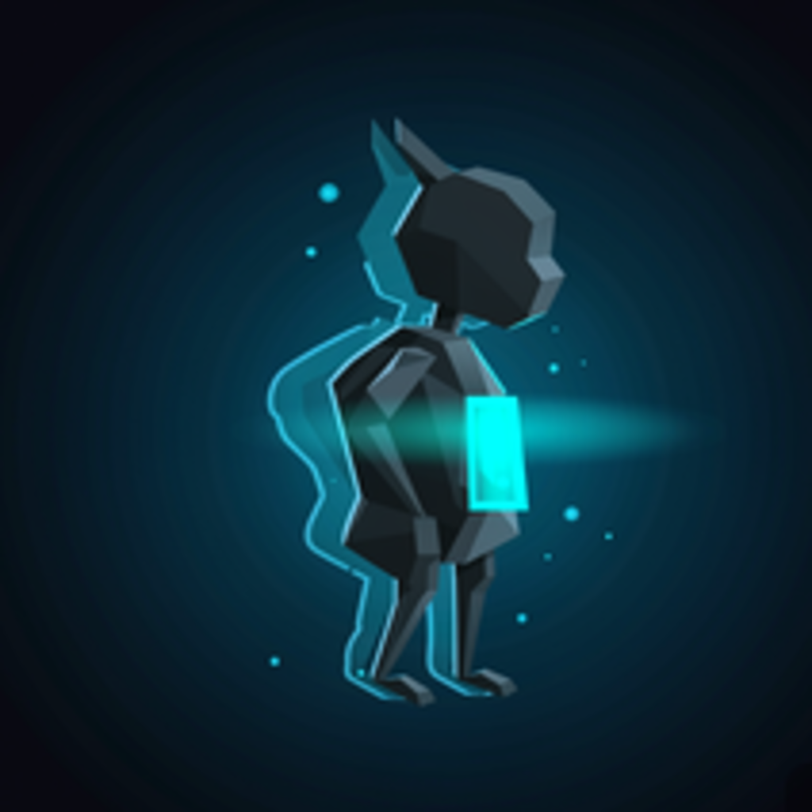

<p align="center">
  <picture>
    <source media="(prefers-color-scheme: dark)" srcset="icon.png">
    
  </picture>
  <h1 align="center">Godot Line</h1>
  <p align="center">
    <em>基于 Godot 4.7 的 Dancing Line 游戏模板框架</em>
  </p>
</p>

<p align="center">
  <a href="https://godotengine.org/">
    
  </a>
  <a href="https://github.com/godotline/godot-line/blob/main/LICENSE">
    
  </a>
  <a href="https://github.com/godotline/godot-line/releases">
    
  </a>
  <a href="https://github.com/godotline/GodotLineCollection">
    
  </a>
  <a href="https://github.com/godotline/godot-line/graphs/contributors">
    
  </a>
</p>

<p align="center">
  <a href="#-特性">特性</a> •
  <a href="#-快速开始">快速开始</a> •
  <a href="#-输入控制">输入控制</a> •
  <a href="#-项目结构">项目结构</a> •
  <a href="#-脚本系统">脚本系统</a> •
  <a href="#-贡献">贡献</a>
</p>

---

## ✨ 特性

- **🎮 Dancing Line 核心玩法** — 完整的线条游戏机制，流畅的转向与节奏交互
- **🔄 高兼容性** — 与冰焰模板 3 / 4 对齐，便捷的关卡迁移体验
- **📦 开箱即用** — 内置完整游戏框架、模板系统与关卡编辑器插件
- **🧩 模块化设计** — 三层触发器体系（纯组件 / 自包含 / 传统），清晰易扩展
- **⚡ Jolt Physics** — 独立线程物理引擎，流畅稳定的碰撞体验
- **🌐 跨平台** — 支持 Windows、Linux、macOS
- **🔌 MCP 支持** — 内置 godot_mcp 插件，支持 AI 辅助开发
- **📤 一键发布** — 支持将关卡发布到 [GodotLineCollection](https://github.com/godotline/GodotLineCollection)

## 🚀 快速开始

### 环境要求

| 依赖 | 版本 |
|------|------|
| Godot Engine | **4.7** 或更高（.NET 版本可选） |
| 渲染器 | Mobile（项目默认） |
| 物理引擎 | Jolt Physics（独立线程） |

### 安装

```bash
git clone https://github.com/godotline/godot-line.git
cd godot-line
```

在 Godot 4.7 中导入项目，选择 `Default.tscn` 作为主场景，按 `F5` 运行。

### 新建关卡

使用编辑器工具栏 **Template > 新建关卡**，自动创建关卡场景与 LevelData 资源。

## 🎮 输入控制

| 操作 | 按键 | 说明 |
|------|------|------|
| 转向 | `鼠标左键` / `Space` | 控制线条转向 |
| 重试 | `R` | 重新加载当前关卡 |
| 击杀 | `K` | 立即结束当前局 |
| 调试 | `D` | 切换调试覆盖层（仅 Debug 构建） |
| 音乐时间 | `C` | 编辑器内打印音乐播放位置 |
| 假玩家转向 | `P` | 假玩家手动转向（`FakePlayer` 可配置） |
| 变速 | `T` | 切换游戏速度倍率（`TimeScale` 可配置） |

## 📁 项目结构

```
godot-line/
├── #Template/                  # 核心模板系统
│   ├── [Scripts]/              # GDScript 源码
│   │   ├── Animator/           #   动画控制器
│   │   ├── Auto/               #   自动播放系统
│   │   ├── CameraScripts/      #   摄像机跟随（新旧两代）
│   │   ├── Editor/             #   编辑器工具脚本
│   │   ├── GUI/                #   游戏界面逻辑
│   │   ├── Guidance/           #   引导系统
│   │   ├── Level/              #   关卡管理
│   │   ├── Settings/           #   设置与延迟配置
│   │   └── Trigger/            #   触发器组件（纯组件模式）
│   ├── [Resources]/            # 场景、模型、UI 资源
│   ├── [Materials]/            # 材质资源
│   ├── [Music]/                # 音频文件
│   ├── Player.tscn             # 玩家场景
│   ├── Trigger.tscn            # 触发器容器场景
│   ├── Gem.tscn                # 钻石场景
│   ├── Obstacle.tscn           # 障碍物场景
│   ├── Ground.tscn             # 地面场景
│   ├── Pyramid.tscn            # 金字塔场景
│   ├── Crystal.tscn            # 水晶场景
│   ├── CameraRoot.tscn         # 摄像机根节点
│   ├── CrownCheckPoint.tscn    # 皇冠检查点
│   ├── HeartCheckPoint.tscn    # 心脏检查点
│   ├── TTFCheckPoint.tscn      # 文字检查点
│   ├── FakePlayer.tscn         # 假玩家（路点展示）
│   ├── FallPredictor.tscn      # 坠落预测器
│   └── Percentage.tscn         # 进度百分比显示
├── [Scenes]/                   # 关卡场景
│   ├── DefaultScene/           # 默认主关卡
│   └── Sample/                 # 示例关卡
├── addons/
│   ├── template/               # 编辑器插件（工具栏、关卡创建）
│   └── godot_mcp/              # MCP 服务器插件（AI 辅助开发）
├── project.godot               # 项目配置
├── export_presets.cfg          # 导出预设
└── icon.png                    # 项目图标
```

## 🧩 脚本系统

### 触发器 — 三种模式共存

| 模式 | 基类 | 碰撞处理 | 示例 |
|------|------|----------|------|
| **纯组件** (推荐) | `extends Node3D` | 父级 `BaseTrigger` | `Jump.gd`, `Speed.gd`, `KillPlayer.gd` |
| **自包含** | `extends BaseTrigger` | 自身 Area3D | `PyramidTrigger.gd`, `PropertyModifierTrigger.gd` |
| **传统** | `extends Area3D` | 自身 `body_entered` | `Gem.gd`, `Checkpoint.gd` |

### 核心单例

| 类名 | 类型 | 职责 |
|------|------|------|
| `LevelManager` | `RefCounted` | 游戏状态机、检查点、复活监听 |
| `AudioManager` | `RefCounted` | 音频播放与控制 |
| `SetLatency` | `RefCounted` | 延迟/音量配置持久化 |
| `CameraFollower` | `class_name` | 新摄像机跟随系统 |
| `OldCameraFollower` | `class_name` | 旧摄像机跟随系统 |

## 📖 文档

- 📘 [详细教程与 API 文档](https://www.cnblogs.com/mmme/p/-/tutorial)
- 📝 [贡献指南](./CONTRIBUTING.md)
- 🔧 [插件商店](https://github.com/godotline/GodotPlugins)（通过 Template > 插件商店安装）

## 🤝 贡献

欢迎贡献！请遵循以下流程：

1. Fork 本仓库
2. 创建特性分支：`git checkout -b feat/your-feature`
3. 提交更改：`git commit -m 'Add: some feature'`
4. 推送：`git push origin feat/your-feature`
5. 创建 Pull Request

> 代码规范请遵循 [Godot GDScript 风格指南](https://docs.godotengine.org/en/stable/tutorials/scripting/gdscript/gdscript_styleguide.html)。所有脚本需使用显式类型注解。

## 📬 联系方式

- **🐛 Bug 反馈** — [GitHub Issues](https://github.com/godotline/godot-line/issues)
- **💬 交流群** — [GodotLine 模板交流群](http://qm.qq.com/cgi-bin/qm/qr?_wv=1027&k=NnqD9QUw7D9K3wAuCI-IT1-PNO9LB7FR&authKey=RXS5hzAQnpevmQvAZVKSt7qL9%2FDtJsvpgJmP1aWV7aC7jwlZekV8%2FW9NerB9Blqv&noverify=0&group_code=1074036493)
- **📦 关卡发布** — [GodotLineCollection](https://github.com/godotline/GodotLineCollection)

## 📄 许可证

本项目基于 [MIT License](./LICENSE) 开源。

## 🙏 致谢

- [Godot Engine](https://godotengine.org/) — 强大的开源游戏引擎
- [ShinnLine](https://github.com/Ironnoob73/DancingLineGodotTemplate) — 原始项目参考
- 冰焰模板 — 设计参考与对齐标准
- 所有贡献者与社区成员 ❤️

---

<p align="center">
  <sub>Made with ❤️ using Godot Engine 4.7</sub>
  <br>
  <a href="https://deepwiki.com/godotline/godot-line">
    
  </a>
</p>